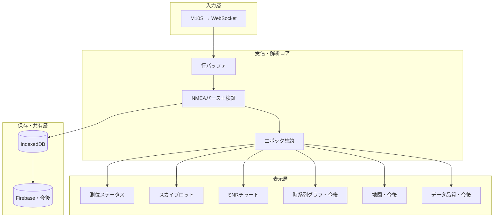
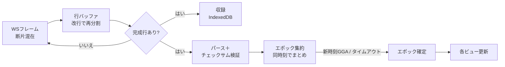
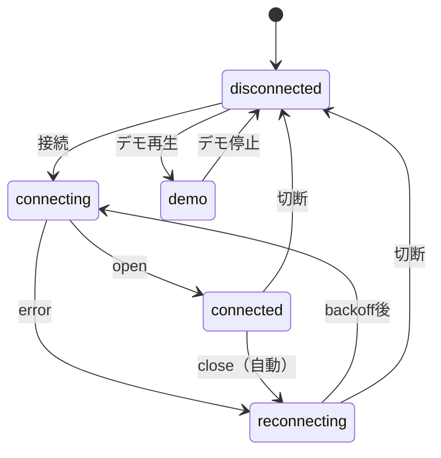

# GNSS Scope / NMEA 分析アプリ — 機能仕様書

> PicoW + u-blox MAX-M10S が WebSocket で流す生 NMEA を受信し、測位の有効性・データ品質・
> 衛星の見え方・精度をリアルタイムに可視化し、収録・事後解析するアプリの機能仕様。

---

## 0. このドキュメントの使い方

- **仕様書**として、機能の合意・抜け漏れ確認の土台にする。
- **実装プロンプト**として、Cursor / Claude Code にこのまま渡して着手できるよう、
  各機能に ID・入出力・受け入れ基準を付けている。
- **実装済みの土台**（下記）を前提とし、AI に再実装させないこと。今回はこの仕様で
  「未実装（今後）」とした機能を順に足していく。

### 実装済みの土台（再実装しない）

| モジュール | 役割 |
|---|---|
| `js/nmea.js` | NMEAパース（GGA/RMC/GSA/GSV）＋チェックサム検証、コンステ色定義 |
| `js/line-buffer.js` | WSフレームを改行で行に再分割（断片結合） |
| `js/epoch.js` | 同一時刻のセンテンスを1エポックに集約 |
| `js/ws-client.js` | WebSocket接続＋指数バックオフ自動再接続 |
| `js/recorder.js` | 生フレームを IndexedDB に収録 |
| `js/views/fix-status.js` | 測位ステータス表示 |
| `js/views/sky-plot.js` | スカイプロット |
| `js/views/snr-chart.js` | SNRチャート |
| `js/dev/mock-feeder.js` | Picoなしの合成NMEA生成（開発用） |

---

## 1. 目的とスコープ

### 目的
M10S の測位がいま健全か（有効・精度・衛星状況）を現場で一目で把握し、ログとして残して
あとで腰を据えて分析できるようにする。とくに箕面エリアのハイキング用途で、谷筋・樹林下・
市街地での測位の荒れ方を定量的に見られることを狙う。

### スコープ
- **入力は WebSocket 経由の生 NMEA に限定**（USB シリアル等は対象外）。
- 対象センテンス：GGA / RMC / GSA / GSV（精度深掘り用に GST を将来対応）。
- **MVP**：受信基盤＋測位ステータス＋スカイプロット＋SNR＋収録。
- **今後**：時系列グラフ、精度分析（GST・静止散布）、地図、データ品質レポート、
  コンステ貢献度／QZSS分析、再生UI、比較モード。

---

## 2. 全体構成

設計方針：入力をどこから取ってもパーサ以降を共通化する。ライブ受信も収録の再生も、
同じ `parseSentence → EpochAssembler` を通す。

---

## 3. データフロー

---

## 4. 入力仕様

### 4.1 WebSocket
- 接続先 `ws://<host>:<port>` をユーザーが指定。Pico 側が WebSocket サーバ
  （実機 `main.py` は `ws://picow.local/`・ポート80でサーバ起動）。
- 実機ファームは **1 WebSocket フレーム＝1行（`strip()` 済み・改行なし）** で送る。
  将来「改行区切りのバイト列がフレーム境界で割れる」形になっても両対応する（4.2）。
- 切断時は指数バックオフ（初期500ms、上限15s）で自動再接続。
- **制約**：HTTPS ページからは `ws://` に接続不可（mixed content）。
  ライブ取り込みは HTTP（localhost / LAN）で開く前提。HTTPS（Vercel）は収録データの
  解析・共有用とする。仕様としてこの役割分担を明記する。

### 4.2 行バッファ
- 改行（`\r\n`/`\n`）で分割し、末尾の未完断片は次チャンクへ持ち越す。
- 加えて、改行が無くても **NMEA のチェックサム `*XX` で終わっていれば完結した1文として確定**
  する（実機ファームの「1フレーム1行・改行なし」に対応）。途中断片は `*XX` 未到達なので持ち越す。
- 空行は捨てる。接続終了時に `flush()` で残りを処理。

### 4.3 対応 NMEA センテンス

| センテンス | 用途 | 主フィールド | 状態 |
|---|---|---|---|
| GGA | 測位品質・座標 | quality, numSV, hdop, alt, time, lat/lon | 実装済 |
| RMC | 有効性・速度・日付 | status(A/V), speed, course, date | 実装済 |
| GSA | 測位モード・DOP・使用衛星 | fixMode, PDOP/HDOP/VDOP, usedSVs, systemId | 実装済 |
| GSV | 可視衛星・SNR・配置 | prn, elev, azim, snr | 実装済 |
| GST | 測位誤差統計（精度） | 緯度経度高度の標準偏差・RMS | **今後** |

---

## 5. データモデル

### 5.1 ParsedSentence（1行のパース結果）
`{ raw, valid:boolean, type, talker, ...型ごとのフィールド }`。チェックサム不正・未対応文は
`valid:false`／既知フィールドのみで返す。

### 5.2 Epoch（同一時刻にまとめた測位スナップショット）— 全ビューの共通入力

| フィールド | 型 | 由来 | 説明 |
|---|---|---|---|
| `time` | obj | GGA/RMC | `{h,m,s,str,key}` UTC |
| `quality` | int | GGA | 0無効/1単独/2DGPS/4RTK固定/5RTK浮動/6推測 |
| `status` | str | RMC | A=有効 / V=無効 |
| `fixMode` | int | GSA | 1なし/2=2D/3=3D |
| `lat,lon,alt` | num | GGA/RMC | 10進度・標高[m] |
| `numSV` | int | GGA | 使用衛星数 |
| `hdop,pdop,vdop` | num | GGA/GSA | 各DOP |
| `speedKn,course` | num | RMC | 速度[kn]・進行方位 |
| `usedSVs` | array | GSA | `{constellation, prn}` |
| `satsInView` | array | GSV | `{constellation, prn, elev, azim, snr}` |
| `inViewCount` | obj | GSV | コンステ別の可視数 |
| `sentenceTypes` | obj | 全 | 種別カウント（品質統計用） |
| `invalidCount` | int | 全 | このエポック中のチェックサム不正数 |

エポック確定規則：新しい時刻の GGA/RMC が来たら直前を確定。GSA/GSV は現エポックに付加。
無新時刻が `idleMs`（既定1.5s）続けばタイムアウト確定（最終エポック対策）。

---

## 6. 機能要件（FR）

> 各機能は ID／概要／入力／表示・出力／受け入れ基準で記述。MVP=実装済み土台の正式仕様、
> 今後=これから実装。

### FR-1 受信基盤（MVP）
- **概要**：WS 接続・再接続・行バッファ・収録への受け渡し。
- **受け入れ基準**：(a) フレームが行境界をまたいでも欠落なく行に復元できる。
  (b) 切断後に自動再接続し、状態（connecting/connected/reconnecting/disconnected）を表示。
  (c) チェックサム不正行は破棄しつつエポックの不正カウントに計上。

### FR-2 パース・エポック集約（MVP）
- **概要**：GGA/RMC/GSA/GSV を構造化し、同一時刻のエポックにまとめる。
- **受け入れ基準**：(a) GGA の使用衛星数・DOP・座標が Epoch に正しく反映。
  (b) 複数コンステの GSA/GSV を1エポックに統合。(c) 時刻変化で前エポックを1回だけ確定。

### FR-3 測位ステータス表示（MVP）
- **概要**：Fix種別・測位モード・使用衛星・HDOP/PDOP/VDOP・座標・標高・UTC・有効測位率。
- **表示**：Fix種別はバッジ色分け（good/ok/warn/bad）。有効測位率＝有効エポック数／全エポック数。
- **受け入れ基準**：エポックごとに即時更新。RMC=V や quality=0 は無効として率に反映。

### FR-4 スカイプロット（MVP）
- **概要**：仰角（中心90°→外周0°）と方位角（北上・時計回り）で衛星を極座標配置。
- **表示**：使用中＝塗り、可視のみ＝中抜き。円の大きさ＝SNR。色＝コンステレーション。
- **受け入れ基準**：方位・仰角の向きが正しい（N上/E右）。使用/可視の区別がつく。

### FR-5 SNR チャート（MVP）
- **概要**：可視衛星ごとの C/N0 棒グラフ。コンステ順→PRN順。
- **表示**：使用中＝濃い、可視のみ＝薄い。0/20/40 dBHz 目盛り、PRNラベル。
- **受け入れ基準**：SNR 欠損衛星は除外。本数が多くても破綻しない。

### FR-6 収録・再生
- **収録（MVP）**：開始/停止で生行を IndexedDB にセッション単位で保存（時刻つき）。
- **再生（今後）**：保存セッションを選び、同じパーサ／集約器に流して全ビューを再現。
  倍速・シーク・一時停止を備える。
- **受け入れ基準**：収録した生行のみで、ライブと同じ解析結果を再現できる。

### FR-7 時系列グラフ（今後）
- **概要**：使用衛星数・各DOP・平均SNR・（GST対応後は）推定誤差を時間軸で表示。
- **表示**：直近 N 秒のスクロール窓。点数が多いので uPlot を想定。
- **受け入れ基準**：1Hz・長時間でも描画が重くならない（後述 NFR）。

### FR-8 精度分析（今後）
- **概要**：受信機推定誤差（DOP・GST の標準偏差/RMS）と、静止時の実測精度。
- **表示**：静止モードでは測位点の散布図＋CEP/2DRMS 円、誤差ヒストグラム。
  DOP と GST 誤差を同一時間軸に重ねる。
- **前提**：M10S で GST 出力を有効化（UBX-CFG）。パーサに GST を追加。

### FR-9 地図表示（今後）
- **概要**：軌跡（移動）／散布（静止）を地理院地図タイル上に Leaflet で表示。
- **受け入れ基準**：オフラインタイル方針（既存知見）と整合。Fix無効点は色で区別。

### FR-10 データ品質レポート（今後）
- **概要**：チェックサム通過率・センテンス種別と更新レート・エポック間隔のジッタ・欠損率。
- **受け入れ基準**：1Hz 設定時に実測間隔のばらつきを可視化（ヒストグラム）。

### FR-11 コンステ貢献度／QZSS 分析（今後）
- **概要**：系別の使用衛星数・SNR を分解し、マルチGNSSの効きを定量化。
  日本特有として QZSS（みちびき）の高仰角寄与・L1S補強の効果を観察。
- **受け入れ基準**：「GPS のみ」と「全系」での衛星数・DOP の差を比較表示。

### FR-12 比較モード（今後）
- **概要**：複数セッション（設置位置・空の見え方・アンテナ違い）を並べて比較。
- **受け入れ基準**：有効率・平均SNR・DOP・散布の主要指標を横並びで比較できる。

---

## 7. 画面・状態

### 7.1 レイアウト（MVP）
上部バー（WS URL 入力・接続・収録・デモ・接続状態・収録状態）＋本体グリッド
（測位ステータス／スカイプロット／SNR）。720px 以下で縦積み。

### 7.2 接続状態の遷移

### 7.3 収録状態
`未収録 → 収録中（開始）→ 未収録（停止: 行数を表示）`。収録は接続/デモと独立に開始可能。

---

## 8. 非機能要件（NFR）

- **NFR-1 配信**：ES モジュールのため HTTP 配信必須（`file://` 不可）。PWA 化を想定。
- **NFR-2 mixed content**：HTTPS から `ws://` 不可。ライブは HTTP、解析/共有は HTTPS の役割分担。
- **NFR-3 性能**：1Hz・連続数時間で UI が劣化しないこと。時系列はリングバッファ＋
  軽量描画（uPlot）。スカイ/SNR は最新エポックで再描画、Canvas を使用。
- **NFR-4 オフライン**：Service Worker でアプリ殻と地図タイルをキャッシュ（既存方針に準拠）。
- **NFR-5 復元性**：受信途切れ・不正文・欠損フィールドで落ちない。欠損は「—」表示。
- **NFR-6 対応環境**：Chromium 系を主対象（PWA/WS/IndexedDB）。
- **NFR-7 アクセシビリティ**：キーボード操作・フォーカス可視・色だけに依存しない区別
  （使用/可視は塗り/中抜きでも区別）。

---

## 9. 将来拡張メモ

- GST 対応で精度の深掘り（推定誤差の時系列・散布との突き合わせ）。
- 環境分類（開空/市街地/樹林下）を SNR分布・低仰角使用率・Fix安定性から推定。
- 静止ドリフト解析（長時間据え置きの揺らぎ、静止時の速度/方位ノイズフロア）。
- 相関分析（使用衛星数 × 平均SNR × HDOP × 実測誤差）。
- Firebase 連携でセッション共有・クラウド比較。

---

## 10. 用語

| 用語 | 意味 |
|---|---|
| NMEA 0183 | GNSS受信機の標準テキスト出力フォーマット |
| DOP | 衛星配置に起因する精度劣化指標（PDOP/HDOP/VDOP） |
| C/N0（SNR） | 搬送波対雑音密度比[dBHz]。信号の強さ・品質 |
| TTFF | 初回測位までの時間 |
| エポック | 同一時刻のセンテンス群＝1回の測位スナップショット |
| QZSS | 準天頂衛星システム（みちびき）。日本上空に高仰角 |

---

## 11. 実装プロンプトとしての使い方

Cursor / Claude Code に渡すときの例：

> 添付の機能仕様書に従い、`FR-7 時系列グラフ` を実装してください。
> 既存の `EpochAssembler.onEpoch` から受け取った Epoch を、直近 N 秒のリングバッファに
> 蓄積し、uPlot で「使用衛星数・HDOP・平均SNR」を時間軸表示するビュー
> `js/views/timeseries.js` を追加。NFR-3（性能）と既存のダーク UI（css/style.css の
> 変数・コンステ色）に合わせること。実装済みモジュール（第0章）は再実装しないこと。

このように「FR-番号＋既存土台の参照＋NFR」を指定すると、仕様の範囲で着実に拡張できる。
