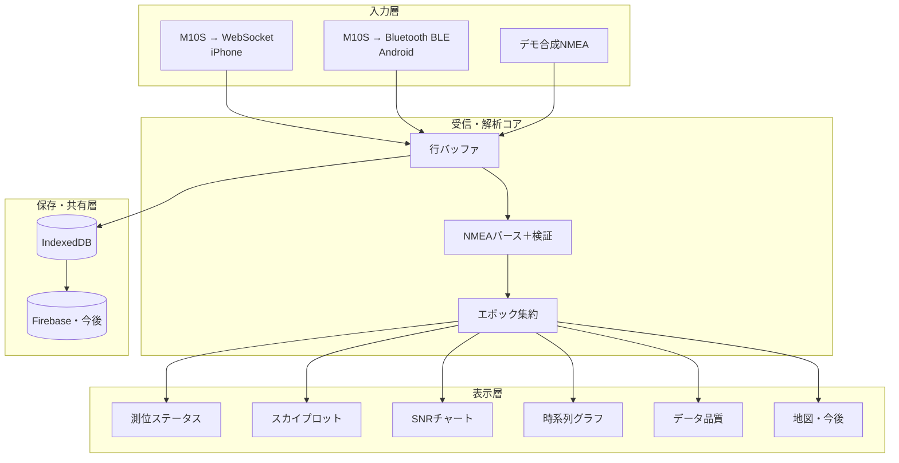
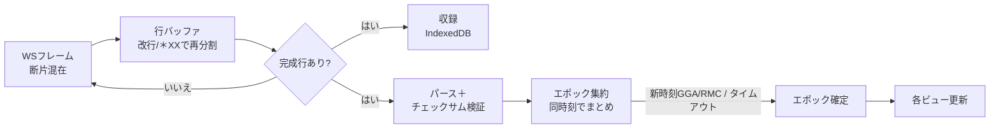
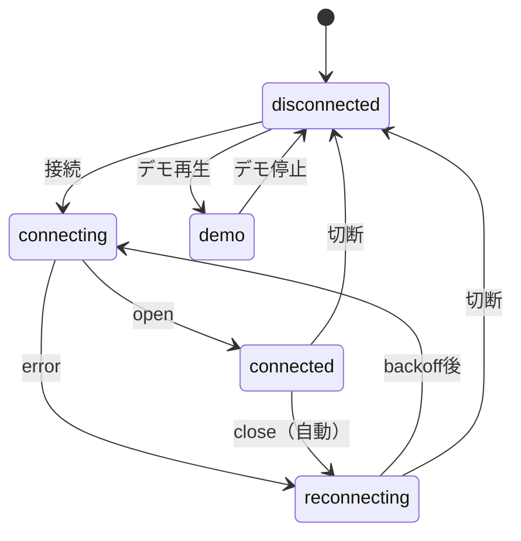

# GNSS Scope / NMEA 分析アプリ — 機能仕様書

- **文書バージョン**：2026.2
- **最終更新**：2026-06-10
- **対象**：現在のコード（`index.html` ＋ `js/`・`css/`・`micropython/main.py`）に基づく実装ベースの機能仕様

> PicoW + u-blox MAX-M10S が流す生 NMEA を、**WebSocket または Bluetooth(BLE) の選択式**で受信し、
> 測位の有効性・データ品質・衛星の見え方・精度をリアルタイムに可視化し、収録・事後解析するブラウザアプリ。
> 本書は「仕様として何を満たすか」と「現状コードで何が実装済みか」を併記する。

---

## 0. 概要と全体像

### 0.1 目的
M10S の測位がいま健全か（有効・精度・衛星状況）を現場で一目で把握し、ログとして残して
あとで分析できるようにする。とくに箕面エリアのハイキング用途で、谷筋・樹林下・市街地での
測位の荒れ方を定量的に見られることを狙う。

### 0.2 スコープ
- **入力は WebSocket または Bluetooth(BLE) 経由の生 NMEA**（USB シリアル等は対象外）。
  受信側 UI でトランスポートを選択する（端末に応じて自動初期選択）。
  - iPhone / iPad → **WebSocket**（iOS は Web Bluetooth 非対応のため）
  - Android → **Bluetooth(BLE)**（Web Bluetooth 対応。HTTPS ページからも接続可・IP 入力不要）
- 対象センテンス：GGA / RMC / GSA / GSV（精度深掘り用に GST を将来対応）。
- 構成：単一の `index.html` ＋ ES モジュール（`js/`）。ビルド不要、HTTP/HTTPS 配信で動作。
  Pico W 側ファーム `micropython/main.py` は WS と BLE を同時配信する。

### 0.3 モジュール構成（現状コード）

| モジュール | 役割 | 状態 |
|---|---|---|
| `js/nmea.js` | NMEAパース（GGA/RMC/GSA/GSV）＋チェックサム検証、コンステ色・定義 | 実装済 |
| `js/line-buffer.js` | WSフレームを改行／`*XX` で行に再分割（断片結合） | 実装済 |
| `js/epoch.js` | 同一時刻のセンテンスを1エポックに集約 | 実装済 |
| `js/ws-client.js` | WebSocket接続＋指数バックオフ自動再接続（iPhone向け） | 実装済 |
| `js/ble-client.js` | Bluetooth(BLE/Web Bluetooth, Nordic UART Service)接続＋自動再接続（Android向け） | 実装済 |
| `js/recorder.js` | 生行を IndexedDB に収録＋再生用取り出し（`listSessions`/`loadLines`） | 実装済 |
| `js/views/fix-status.js` | 測位ステータス表示 | 実装済 |
| `js/views/sky-plot.js` | スカイプロット（Canvas） | 実装済 |
| `js/views/snr-chart.js` | SNRチャート（Canvas） | 実装済 |
| `js/views/timeseries.js` | 時系列グラフ（uPlot） | 実装済 |
| `js/views/data-quality.js` | データ品質レポート（Canvas ヒストグラム） | 実装済 |
| `js/dev/mock-feeder.js` | Picoなしの合成NMEA生成（デモ） | 実装済 |
| `js/app.js` | 全体配線・上部バーUI・トランスポート選択（WS/BLE） | 実装済 |
| `micropython/main.py` | Pico W ファーム。生NMEAを WS と BLE(NUS) で同時配信 | 実装済 |

### 0.4 全体構成

設計方針：入力をどこから取ってもパーサ以降を共通化する。WebSocket でも Bluetooth でも
デモでも収録の再生でも、トランスポート層を `onFrame(文字列)` の1点に隔離し、同じ
`LineBuffer → parseSentence → EpochAssembler` を通す。`NmeaWebSocket` と `NmeaBle` は
同一インターフェース（`connect`/`disconnect`/`onFrame`/`onStatus`/`shouldRun`）を実装し、
受信後段（収録・解析・全ビュー）はトランスポートに依存しない。

---

## 1. データフロー

---

## 2. 入力仕様

### 2.0 トランスポート選択（`js/app.js`）
- 上部バーの「接続方式」セレクタで **WebSocket** か **Bluetooth** を選ぶ。
- **初期選択は自動**：Web Bluetooth が使える環境（セキュアコンテキスト＝HTTPS/localhost かつ
  対応ブラウザ）なら Bluetooth、使えない環境（iPhone / http 接続など）なら WebSocket。
- WebSocket 選択時は URL 入力欄を表示、Bluetooth 選択時は隠す（デバイス選択ダイアログで繋ぐため）。
- Bluetooth が使えない場合は理由を画面に明示（要 HTTPS／端末非対応）。詳細は 2.1b。
- どちらの方式でも受信後段（行バッファ以降）は共通。

### 2.1 WebSocket（`js/ws-client.js`）— iPhone 向け
- 接続先 `ws://<host>:<port>` をユーザーが指定。既定値は `ws://picow.local/`。
  Pico 側が WebSocket サーバ（実機 `main.py` は `ws://picow.local/`・ポート80）。
- 実機ファームは **1 WebSocket フレーム＝1行（`strip()` 済み・改行なし）** で送る。
  将来「改行区切りのバイト列がフレーム境界で割れる」形になっても両対応する（2.2）。
- 受信データは文字列／`ArrayBuffer`／`Blob` のいずれでも受け取り、文字列化して行バッファへ渡す。
- 切断時は指数バックオフ（初期500ms・2倍ずつ・上限15s）で自動再接続。`open` で 500ms に復帰。
- 状態は `disconnected / connecting / connected / reconnecting` を通知。
- **制約**：HTTPS ページからは `ws://` に接続不可（mixed content）。
  ライブ取り込みは HTTP（localhost / LAN）で開く前提。

### 2.1b Bluetooth / BLE（`js/ble-client.js`）— Android 向け
- **Web Bluetooth API** で Pico W の **Nordic UART Service(NUS)** に接続し、TX キャラクタリスティック
  の notify で生 NMEA を受ける（UUID は `main.py` と一致）。
  - Service：`6E400001-…`／TX(notify, 周辺→中央)：`6E400003-…`／RX(write, 未使用)：`6E400002-…`
- 「接続」でデバイス選択ダイアログを出し、`picow`（名前前方一致 or NUS UUID）を選ぶ。
  選択にはユーザー操作が必要（仕様）。一度選べば以後の再接続はユーザー操作不要。
- 受信 notify（断片可・改行含む）を文字列化して行バッファへ渡す。Pico 側は行末に `\n` を付け、
  ATT_MTU に収まるよう分割して notify するため、行バッファで確実に再分割される。
- 切断時は指数バックオフ（初期500ms・上限15s）で既知デバイスへ自動再接続。
- 状態は `disconnected / connecting / connected / reconnecting / unsupported` を通知。
- **制約**：
  - **セキュアコンテキスト必須**（HTTPS または localhost）。`http://<IP>` では `navigator.bluetooth`
    が無く接続不可 → `unsupported` 扱い。Android は HTTPS 配信版で開けば `ws://` の mixed content
    制約も受けずにライブ取り込みできる。
  - **iOS（iPhone/iPad）は全ブラウザで Web Bluetooth 非対応**。iPhone は WebSocket を使う。
  - BLE は WiFi に依存しないため、Pico が WiFi 圏外でも Android は接続可能。

### 2.2 行バッファ（`js/line-buffer.js`）
- 改行（`\r\n`/`\n`）で分割し、末尾の未完断片は次チャンクへ持ち越す。
- 改行が無くても **NMEA のチェックサム `*XX` で終わっていれば完結した1文として確定**
  （実機ファームの「1フレーム1行・改行なし」に対応）。途中断片は `*XX` 未到達なので持ち越す。
- 空行は捨てる。接続終了時に `flush()` で残りを処理。

### 2.3 対応 NMEA センテンス（`js/nmea.js`）

| センテンス | 用途 | 主フィールド | 状態 |
|---|---|---|---|
| GGA | 測位品質・座標 | quality, numSV, hdop, alt, time, lat/lon, geoidSep | 実装済 |
| RMC | 有効性・速度・日付 | status(A/V), speed, course, date | 実装済 |
| GSA | 測位モード・DOP・使用衛星 | fixMode, PDOP/HDOP/VDOP, usedSVs, systemId | 実装済 |
| GSV | 可視衛星・SNR・配置 | prn, elev, azim, snr | 実装済 |
| GST | 測位誤差統計（精度） | 緯度経度高度の標準偏差・RMS | **今後** |

- **チェックサム検証**：`$`〜`*` の全文字を XOR し、`*` 後ろの16進2桁と比較。
- **マルチGNSS**：talker（GP/GL/GA/GB/BD/GQ/GN）からコンステを判定。GSA は `systemId`
  （NMEA 4.10+）を優先（1=GPS/2=GLONASS/3=Galileo/4=BeiDou/5=QZSS）。
- **座標変換**：`ddmm.mmmm` ＋方位（N/S/E/W）→ 10進度。時刻は `hhmmss.ss` → `{h,m,s,str,key}`。

---

## 3. データモデル

### 3.1 ParsedSentence（1行のパース結果）
`{ raw, valid:boolean, type, talker, ...型ごとのフィールド }`。チェックサム不正・未対応文は
`valid:false`／既知フィールド（talker・type）のみで返す。

### 3.2 Epoch（同一時刻にまとめた測位スナップショット）— 全ビューの共通入力

| フィールド | 型 | 由来 | 説明 |
|---|---|---|---|
| `time` | obj | GGA/RMC | `{h,m,s,str,key}` UTC |
| `timeKey` | str | GGA/RMC | エポック判別キー（`hhmmss.ss`） |
| `recvAt` | num | 全 | 受信時刻 `Date.now()`（時系列・品質の時間軸） |
| `quality` | int | GGA | 0無効/1単独/2DGPS/4RTK固定/5RTK浮動/6推測 |
| `status` | str | RMC | A=有効 / V=無効 |
| `fixMode` | int | GSA | 1なし/2=2D/3=3D（複数系の最大を採用） |
| `lat,lon,alt` | num | GGA/RMC | 10進度・標高[m] |
| `numSV` | int | GGA | 使用衛星数 |
| `hdop,pdop,vdop` | num | GGA/GSA | 各DOP |
| `speedKn,course` | num | RMC | 速度[kn]・進行方位 |
| `usedSVs` | array | GSA | `{constellation, prn}` |
| `satsInView` | array | GSV | `{constellation, prn, elev, azim, snr}` |
| `inViewCount` | obj | GSV | コンステ別の可視数 |
| `sentenceTypes` | obj | 全 | 種別カウント（品質統計用） |
| `invalidCount` | int | 全 | このエポック中のチェックサム不正数 |

エポック確定規則（`js/epoch.js`）：新しい時刻の GGA/RMC が来たら直前を確定。GSA/GSV は現エポックに
付加。無新時刻が `idleMs`（既定1.5s）続けばタイムアウト確定（最終エポック対策）。`flush()` で即時確定。

---

## 4. 機能要件（FR）

> 各機能は ID／概要／表示・出力／受け入れ基準／実装で記述。

### FR-1 受信基盤（実装済）
- **概要**：WS／BLE 接続・再接続・行バッファ・収録への受け渡し。
- **受け入れ基準**：(a) フレーム／notify が行境界をまたいでも欠落なく行に復元。
  (b) 切断後に自動再接続し、状態（connecting/connected/reconnecting/disconnected）を表示。
  (c) チェックサム不正行は破棄しつつエポックの不正カウントに計上。
  (d) WS でも BLE でも (a)〜(c) が同一に成立（後段共通）。
- **実装**：`ws-client.js`／`ble-client.js` ＋ `line-buffer.js`。上部バーのドット色／状態文字で表示。

### FR-1b トランスポート選択（実装済）
- **概要**：受信方式を WebSocket（iPhone）／ Bluetooth・BLE（Android）から選ぶ。
- **受け入れ基準**：(a) セレクタで方式を切り替えられ、選択に応じて URL 欄の表示/非表示が変わる。
  (b) 環境に応じた初期選択（Web Bluetooth 可なら BLE、不可なら WS）。
  (c) BLE が使えない環境では理由（要 HTTPS／端末非対応）を画面に表示。
  (d) 選択した方式に応じて `NmeaWebSocket`／`NmeaBle` を生成し、同じ後段に接続。
- **実装**：`app.js`（`applyTransport`／`bleUnavailableReason`）。

### FR-1c Pico W ファーム：WS/BLE 同時配信（実装済）
- **概要**：`micropython/main.py` が UART(M10S) の生 NMEA を行単位で WS と BLE(NUS) の両方へ配信。
- **受け入れ基準**：(a) WS クライアント（iPhone）と BLE セントラル（Android）が同時接続でも
  両方へ同じ生 NMEA が届く。(b) BLE は WiFi 非依存で常時広告（WiFi 圏外でも Android 接続可）。
  (c) BLE 非対応ファームでも `import bluetooth` 失敗を捕捉して WS のみで継続（落ちない）。
  (d) notify の一時的な送信失敗はリトライし、即時切断しない。
- **実装**：`main.py`（`BlePeripheral`＋メインループの行送出で WS/BLE 両配信）。

### FR-2 パース・エポック集約（実装済）
- **概要**：GGA/RMC/GSA/GSV を構造化し、同一時刻のエポックにまとめる。
- **受け入れ基準**：(a) GGA の使用衛星数・DOP・座標が Epoch に反映。
  (b) 複数コンステの GSA/GSV を1エポックに統合。(c) 時刻変化で前エポックを1回だけ確定。
- **実装**：`nmea.js`（パース）＋ `epoch.js`（集約）。

### FR-3 測位ステータス表示（実装済）
- **概要**：Fix種別・測位モード・使用衛星・HDOP/PDOP/VDOP・座標・標高・UTC・有効測位率。
- **表示**：Fix種別はバッジ色分け。
  - `No fix`(0)=bad / `GPS fix`(1)・`DGPS`(2)=ok / `RTK fixed`(4)・`RTK float`(5)=good / `Dead reckoning`(6)=warn。
  - 測位モード＝No fix / 2D / 3D。緯度経度は小数6桁、標高は0.1m、欠損は「—」。
  - 有効測位率＝有効エポック数／全エポック数。`quality>0 かつ status≠V` を有効とみなす。
- **受け入れ基準**：エポックごとに即時更新。RMC=V や quality=0 は無効として率に反映。
- **実装**：`views/fix-status.js`。

### FR-4 スカイプロット（実装済）
- **概要**：仰角（中心90°→外周0°）と方位角（北上・時計回り）で衛星を極座標配置。
- **表示**：使用中＝塗り、可視のみ＝中抜き。円の大きさ＝SNR。色＝コンステ。
  仰角リング 0/30/60°、方位の十字（N/S/E/W）。各点に PRN ラベル。
- **受け入れ基準**：方位・仰角の向きが正しい（N上/E右）。使用/可視の区別がつく。
- **実装**：`views/sky-plot.js`（Canvas、DPR対応・リサイズ再描画）。

### FR-5 SNR チャート（実装済）
- **概要**：可視衛星ごとの C/N0 棒グラフ。コンステ順→PRN順。
- **表示**：使用中＝濃い（α1.0）、可視のみ＝薄い（α0.4）。0/20/40 dBHz 目盛り、PRNラベル
  （棒幅が十分なときのみ表示）。SNR 欠損衛星は除外。
- **受け入れ基準**：SNR 欠損衛星は除外。本数が多くても破綻しない（棒幅自動調整）。
- **実装**：`views/snr-chart.js`（Canvas）。

### FR-6 収録・再生
- **収録（実装済）**：開始/停止で生行を IndexedDB（DB `gnssMonitorDB`）にセッション単位で保存。
  セッションは `id/startedAt/endedAt/note/lineCount`、各行は `sessionId/t/line`。
  収録は接続・デモと独立に開始可能。停止時に行数を表示。
- **再生（部分実装）**：データ層は実装済（`recorder.listSessions()`／`loadLines(sessionId)` で
  保存セッションの生行を時刻順に取得）。これを同じパーサ／集約器に流せば再解析できる。
  **未実装：再生UI（セッション選択・倍速・シーク・一時停止）と `app.js` への配線。**
- **受け入れ基準**：収録した生行のみで、ライブと同じ解析結果を再現できる。

### FR-7 時系列グラフ（実装済）
- **概要**：使用衛星数・HDOP・平均SNR を時間軸で表示（GST対応後は推定誤差を追加予定）。
- **表示**：直近 300 秒のスクロール窓（リングバッファ）。描画は uPlot（CDN）。
  左軸＝平均SNR[dBHz]、右軸＝使用衛星数、破線＝HDOP。横軸は受信開始からの相対秒。
  平均SNR は使用衛星があれば使用衛星、無ければ可視衛星で平均。
- **受け入れ基準**：1Hz・長時間でも描画が重くならない（NFR-3）。
- **実装**：`views/timeseries.js`。uPlot 未読込時は静かにフォールバック表示。

### FR-8 精度分析（今後）
- **概要**：受信機推定誤差（DOP・GST の標準偏差/RMS）と、静止時の実測精度。
- **表示**：静止モードでは測位点の散布図＋CEP/2DRMS 円、誤差ヒストグラム。DOP と GST を同一時間軸に重ねる。
- **前提**：M10S で GST 出力を有効化（UBX-CFG）。`nmea.js` に GST を追加。

### FR-9 地図表示（今後）
- **概要**：軌跡（移動）／散布（静止）を地理院地図タイル上に Leaflet で表示。
- **受け入れ基準**：オフラインタイル方針と整合。Fix無効点は色で区別。

### FR-10 データ品質レポート（実装済）
- **概要**：チェックサム通過率・センテンス種別と更新レート・エポック間隔のジッタ・GGA欠損率。
- **表示**：通過率＝valid/(valid+invalid)、不正センテンス数、エポック数、GGA欠損率、
  平均エポック間隔[ms]・ジッタ(σ)。種別ごとの累計と更新レート[Hz]。
  エポック間隔ヒストグラム（Canvas、1000ms近傍を強調）。
- **受け入れ基準**：1Hz 設定時に実測間隔のばらつきを可視化（ヒストグラム）。
- **実装**：`views/data-quality.js`。エポックの `sentenceTypes`/`invalidCount`/`recvAt` を集計。

### FR-11 コンステ貢献度／QZSS 分析（今後）
- **概要**：系別の使用衛星数・SNR を分解し、マルチGNSSの効きを定量化。QZSS の高仰角寄与・L1S を観察。
- **受け入れ基準**：「GPS のみ」と「全系」での衛星数・DOP の差を比較表示。

### FR-12 比較モード（今後）
- **概要**：複数セッション（設置位置・空の見え方・アンテナ違い）を並べて比較。
- **受け入れ基準**：有効率・平均SNR・DOP・散布の主要指標を横並びで比較できる。

---

## 5. 画面・状態

### 5.1 レイアウト
上部バー（ブランド＋接続状態ドット・**接続方式セレクタ（WebSocket/Bluetooth）**・WS URL 入力・
接続・収録・デモ・接続状態文字・収録状態・**トランスポート注意書き**）
＋本体グリッド5パネル（測位ステータス／スカイプロット／SNR／時系列／データ品質）。
720px 以下で縦積み。ダーク UI（`css/style.css` の変数・コンステ色）。
Bluetooth 選択時は WS URL 入力欄を隠し、使えない場合は注意書きを赤字表示。

### 5.2 接続状態の遷移

- 接続中にデモを押すと接続を切ってデモへ。デモ中に接続を押すとデモを止めて接続へ（排他）。
- Bluetooth 選択時、デバイス選択をキャンセルすると `disconnected` に戻る。Web Bluetooth 非対応
  環境（iOS / http 接続）では接続を試みると `unsupported` を表示する。
- 上記の状態遷移はトランスポートに依らず共通（WS/BLE とも同じ状態名で通知）。

### 5.3 収録状態
`未収録 → 収録中（開始）→ 未収録（停止: 行数を表示）`。収録は接続/デモと独立に開始可能。

---

## 6. 非機能要件（NFR）

- **NFR-1 配信**：ES モジュールのため HTTP/HTTPS 配信必須（`file://` 不可）。PWA 化を想定。
- **NFR-2 mixed content（WS）**：HTTPS から `ws://` 不可。WS ライブは HTTP、解析/共有は HTTPS の役割分担。
- **NFR-2b セキュアコンテキスト（BLE）**：Web Bluetooth は HTTPS / localhost 必須。Android は
  HTTPS 配信版で BLE ライブ取り込み可（mixed content 制約を受けない）。iOS は Web Bluetooth 非対応。
- **NFR-3 性能**：1Hz・連続数時間で UI が劣化しないこと。時系列はリングバッファ＋uPlot。
  スカイ/SNR/品質ヒストは最新エポックで Canvas 再描画。
- **NFR-4 オフライン**：Service Worker でアプリ殻と地図タイルをキャッシュ（今後）。
- **NFR-5 復元性**：受信途切れ・不正文・欠損フィールドで落ちない。欠損は「—」表示。
- **NFR-6 対応環境**：Chromium 系を主対象（WS/IndexedDB/Canvas）。BLE は Web Bluetooth 対応の
  Chromium 系（Android Chrome/Edge・デスクトップ Chrome/Edge）。iOS は WS のみ。
- **NFR-7 アクセシビリティ**：色だけに依存しない区別（使用/可視は塗り/中抜き・濃淡でも区別）。

---

## 7. 将来拡張メモ

- GST 対応で精度の深掘り（推定誤差の時系列・散布との突き合わせ）。
- 再生UI（FR-6 後半）：保存セッションを選んで倍速・シーク・一時停止で再解析。
- 環境分類（開空/市街地/樹林下）を SNR分布・低仰角使用率・Fix安定性から推定。
- Firebase 連携でセッション共有・クラウド比較。

---

## 8. 用語

| 用語 | 意味 |
|---|---|
| NMEA 0183 | GNSS受信機の標準テキスト出力フォーマット |
| DOP | 衛星配置に起因する精度劣化指標（PDOP/HDOP/VDOP） |
| C/N0（SNR） | 搬送波対雑音密度比[dBHz]。信号の強さ・品質 |
| TTFF | 初回測位までの時間 |
| エポック | 同一時刻のセンテンス群＝1回の測位スナップショット |
| QZSS | 準天頂衛星システム（みちびき）。日本上空に高仰角 |

---

## 9. 改訂履歴

| バージョン | 日付 | 内容 |
|---|---|---|
| 2026.1 | 2026-06-10 | 初版。現状コード（FR-1〜7・10 実装済、FR-6 再生は部分）を反映。 |
| 2026.2 | 2026-06-10 | Bluetooth(BLE) トランスポートとトランスポート選択式を追加（FR-1b/1c）。`ble-client.js`・Pico `main.py` の WS/BLE 同時配信、セキュアコンテキスト要件（NFR-2b）を反映。 |
